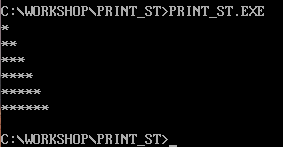
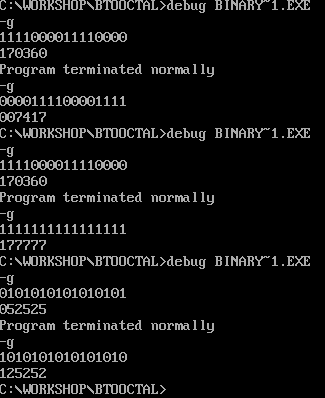

# Thinking

这里是我对汇编课老师给我们留下的一些思考题的代码实现，如果你在课下也写了其它一些有趣的汇编代码，欢迎提PR。

## 打印星星
### 题目要求
打印6行星星，其中第一行打印1个，第二行两个，第三行3个...第6行6个星星。
### 代码实现
[./print_stars](./print_stars)
### 运行结果

## 2进制转8进制
### 题目要求
输入一个16位二进制数，输出一个8进制数。
### 代码实现
[./convert](./convert)
### 运行结果
